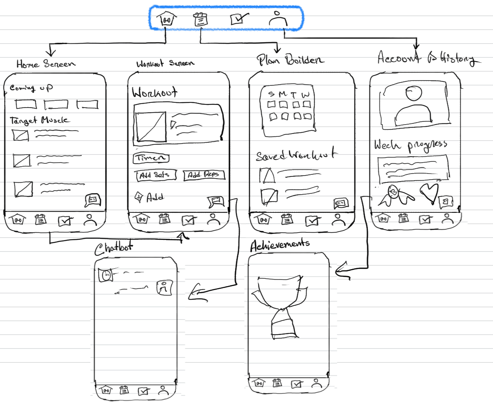

Original App Design Project - README Template
===

# FitForge: AI Workout Planner App

## Table of Contents

1. [Overview](#Overview)
2. [Product Spec](#Product-Spec)
3. [Wireframes](#Wireframes)
4. [Schema](#Schema)

## Overview

### Description

FitForge is an intelligent workout planning app designed to help beginners and fitness enthusiasts browse categorized exercises, build personalized workout routines, and track their progress.  
The app integrates with Apple HealthKit to monitor sets, reps, and calories burned while providing AI-powered workout suggestions based on individual goals.  
Users earn achievement badges as they complete workouts, motivating them to stay consistent without needing a personal trainer.

## Walkthrough 

    
    
  

### App Evaluation

- **Category:** Health & Fitness  
- **Mobile:** Leverages Apple HealthKit, push notifications for reminders, and device sensors for activity tracking. Offers offline progress storage and rest timers with vibration feedback. ✅  
- **Story:** Empowers users to take control of their fitness journey with guided plans, AI recommendations, and accomplishment rings that reward consistency. ✅  
- **Market:** Broad target audience ranging from beginners to gym regulars; fitness apps have millions of active users globally. ✅  
- **Habit:** Encourages daily or weekly engagement with progress stats and motivational badges. Users create and complete plans actively. ✅  
- **Scope:** MVP includes workout browsing, plan creation, and completion tracking. Future updates will add AI suggestions, HealthKit integration, and social community features. ✅  

---

## Product Spec

### User Stories (Required and Optional)

**Required Must-have Stories**

- As a **beginner in fitness**, I want to:
  - Browse exercises categorized by muscle groups
  - View exercise details with images and instructions
  - Mark workouts as completed
  - See my workout history and progress stats
  - Receive daily reminders to stay on track  

**Optional Nice-to-have Stories**

- AI-based workout suggestions tailored to my goals  
- Weekly workout planning with achievement badges  
- Apple HealthKit integration for calories burned tracking  
- Rest timer with haptic feedback  
- Social sharing of workout plans and progress  

---

### 🎯 Mobile Screen Archetypes (FitForge)

1. **Login / Register**
   - User can create an account or log in using username/password.
   - Option for biometric login (FaceID/TouchID).
   - ✅ Required for personalized workout tracking and saving plans.

2. **Stream (Home Screen - Workout Database)**
   - Displays a scrollable list of workouts fetched from API.
   - Allows filtering by muscle groups and searching exercises.
   - ✅ Essential for browsing and discovering exercises.

3. **Detail (Workout Detail Screen)**
   - Shows complete details of a workout:
     - Exercise name
     - Image
     - Sets/reps
     - Target muscles
     - Description
   - User can add the workout to their custom plan.
   - ✅ Required for understanding each exercise fully.

4. **Creation (Plan Builder Screen)**
   - User creates or edits daily/weekly workout plans.
   - Drag-and-drop or add/remove exercises.
   - ✅ Core feature enabling custom routine building.

5. **Profile (History & Achievements Screen)**
   - Displays completed workouts, progress stats, and achievement badges.
   - Shows weekly/monthly activity summary.
   - ✅ Encourages habit formation and rewards users.

6. **Settings**
   - Allows users to:
     - Enable/disable push notifications
     - Connect Apple Health
     - Manage account preferences
   - ⚙️ Optional but recommended for user control.

---

### ✅ Extended Archetypes Used

- **Splash Page:** Quick app logo screen during launch.
- **Onboarding:** First-time user tutorial on how to use the app.
- **Media Player:** Rest timer with start/stop controls.

## Documenting Navigation Flows

### **Tab Navigation (Tab to Screen)**

- **Home** → Workout Database  
- **My Plan** → Plan Builder & Today's Workouts  
- **History** → Completed Workouts & Achievements  

---

### **Flow Navigation (Screen to Screen)**

- **Login Screen**  
  - ➡️ Home (Workout Database)

- **Home (Workout Database)**  
  - ➡️ Workout Detail Screen (when tapping on an exercise)  
  - ➡️ My Plan (when adding exercises to a plan)  

- **Workout Detail Screen**  
  - ➡️ Add to Plan → My Plan  
  - ⬅️ Back to Home

- **My Plan (Plan Builder)**  
  - ➡️ Start Workout → Workout Tracker Screen  
  - ⬅️ Back to Home

- **Workout Tracker Screen**  
  - ➡️ History (after completing a workout)  
  - ⬅️ Back to My Plan

- **History Screen**  
  - ➡️ Workout Detail (to review past workouts)  
  - ⬅️ Back to History or Home

---

### **Example Flow**

1. **Login → Home → Workout Detail → Add to Plan → My Plan → Start Workout → Tracker → History**

## Wireframes

Will do later  
[Add picture of your hand-sketched wireframes in this section]  

### [BONUS] Digital Wireframes & Mockups

### [BONUS] Interactive Prototype

---

## Schema

Will do later  
[This section will be completed in Unit 9]

### Models

- **Workout**  
  - id: Int  
  - name: String  
  - description: String  
  - muscleGroup: String  
  - imageURL: String  
  - sets: Int  
  - reps: Int  

- **Plan**  
  - id: Int  
  - name: String  
  - workouts: [Workout]  
  - day: String  

- **History**  
  - id: Int  
  - date: Date  
  - completedWorkouts: [Workout]  
  - totalCaloriesBurned: Int  

### Networking

- **Network Requests**  
  - GET: Fetch workouts from WGER API  
  - POST: Save user’s custom plan  
  - GET: Retrieve workout history  
  - PUT: Update workout completion status  

- **API Endpoints**  
  - `GET https://wger.de/api/v2/exercise` → List workouts  
  - `GET https://wger.de/api/v2/exerciseimage` → Workout images  
  - `POST /plans` → Save custom plan  
  - `GET /history` → Fetch completed workouts  
